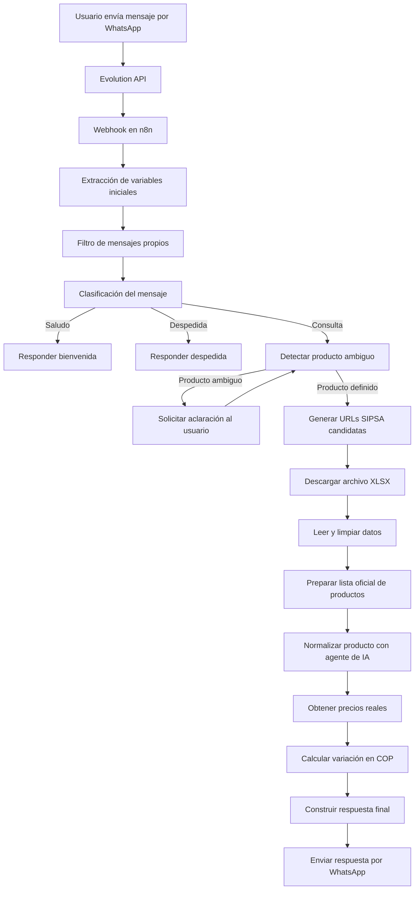

# Pipeline del módulo de precios MercoIA

## 1. Descripción general

El módulo de precios de MercoIA es un asistente conversacional conectado a WhatsApp que permite consultar precios mayoristas de productos agropecuarios. El sistema recibe mensajes de los usuarios, interpreta la solicitud, consulta la fuente oficial SIPSA Diario del DANE y responde con precios por kilogramo para las plazas mayoristas configuradas.

Actualmente, el módulo está implementado mediante un flujo de trabajo en n8n, integrado con Evolution API para la comunicación con WhatsApp.

## 2. Objetivo del módulo

El objetivo del módulo es automatizar la consulta de precios mayoristas de productos agropecuarios mediante una interfaz conversacional por WhatsApp, entregando al usuario información clara sobre:

* Producto consultado.
* Fecha del reporte.
* Plaza mayorista.
* Región.
* Precio en COP por kilogramo.
* Variación aproximada en COP frente al día de mercado anterior.

## 3. Tecnologías utilizadas

El módulo actual utiliza las siguientes tecnologías:

| Tecnología          | Función dentro del módulo                            |
| ------------------- | ---------------------------------------------------- |
| WhatsApp            | Canal de comunicación con el usuario final           |
| Evolution API       | API para recibir y enviar mensajes de WhatsApp       |
| n8n                 | Orquestador del flujo de trabajo                     |
| SIPSA Diario - DANE | Fuente oficial de precios agropecuarios              |
| XLSX                | Formato de los anexos diarios consultados            |
| JavaScript          | Código usado en nodos Code de n8n                    |
| Agente de IA        | Normalización del producto solicitado por el usuario |

## 4. Fuente de datos

La fuente principal de datos es SIPSA Diario del DANE. El sistema consulta los anexos diarios publicados en formato XLSX.

La URL del archivo se construye dinámicamente según la fecha solicitada por el usuario. Por ejemplo, si el usuario solicita información de una fecha específica, el flujo genera candidatos de URL para esa fecha y prueba la disponibilidad del archivo.

Si el usuario no indica una fecha, el sistema busca la base SIPSA más reciente disponible.

## 5. Estructura lógica de los datos

Aunque el módulo actualmente no depende de una base de datos relacional propia para almacenar precios históricos, durante la ejecución del flujo se construye una estructura interna de datos a partir del archivo XLSX consultado.

Los campos principales son:

| Campo interno          | Descripción                                 |
| ---------------------- | ------------------------------------------- |
| `nombre`               | Nombre del producto reportado por SIPSA     |
| `precio_centroabastos` | Precio del producto en Centroabastos S.A.   |
| `var_centroabastos`    | Variación reportada para Centroabastos S.A. |
| `precio_corabastos`    | Precio del producto en Corabastos S.A.      |
| `var_corabastos`       | Variación reportada para Corabastos S.A.    |

Las plazas mayoristas configuradas actualmente son:

| Región      | Plaza mayorista    |
| ----------- | ------------------ |
| Santander   | Centroabastos S.A. |
| Bogotá D.C. | Corabastos S.A.    |

## 6. Pipeline funcional actual

El flujo general del módulo es el siguiente:

```text
Usuario en WhatsApp
↓
Evolution API
↓
Webhook de n8n
↓
Extracción de variables iniciales
↓
Filtro de mensajes propios
↓
Clasificación del mensaje
↓
Detección de producto ambiguo
↓
Generación de URLs SIPSA candidatas
↓
Descarga del archivo XLSX oficial
↓
Lectura y limpieza de la base
↓
Preparación de lista oficial de productos
↓
Normalización del producto solicitado
↓
Extracción de precios reales
↓
Cálculo de variación en pesos
↓
Construcción de respuesta
↓
Envío por WhatsApp
```

## 7. Diagrama del pipeline



## 8. Extracción de características del mensaje

Desde cada mensaje enviado por el usuario se extraen características que permiten decidir cómo debe responder el sistema.

Las principales características extraídas son:

| Característica        | Descripción                                                  |
| --------------------- | ------------------------------------------------------------ |
| `mensaje_original`    | Texto enviado por el usuario                                 |
| `mensaje_limpio`      | Texto normalizado, sin tildes ni caracteres innecesarios     |
| `tipo_mensaje`        | Clasificación del mensaje: saludo, despedida o consulta      |
| `producto_crudo`      | Producto mencionado por el usuario antes de la normalización |
| `fecha_solicitada`    | Fecha detectada en lenguaje natural                          |
| `es_producto_ambiguo` | Indica si el producto requiere aclaración                    |
| `grupo_ambiguo`       | Grupo del producto ambiguo, por ejemplo papa o plátano       |
| `producto_resuelto`   | Producto final cuando el usuario aclara una opción           |

## 9. Clasificación del mensaje

El sistema clasifica cada mensaje en tres tipos principales:

| Tipo de mensaje     | Acción del sistema                                                            |
| ------------------- | ----------------------------------------------------------------------------- |
| Saludo sin producto | Envía un mensaje de bienvenida y ejemplos de consulta                         |
| Despedida           | Envía un mensaje de cierre                                                    |
| Consulta            | Continúa con el proceso de detección de producto, fecha y búsqueda de precios |

Ejemplos de saludos detectados:

```text
hola
buenas
buenos días
hols
hla
ola
```

Ejemplos de despedidas detectadas:

```text
gracias
muchas gracias
hasta luego
chao
eso es todo
```

## 10. Filtro de mensajes propios

El flujo debe evitar procesar mensajes enviados por la propia instancia del bot. Para esto se verifica el campo asociado a mensajes salientes, como `fromMe`.

Si el mensaje fue enviado por el propio bot, el flujo lo ignora. Esto evita bucles innecesarios y reduce la carga sobre Evolution API.

## 11. Detección de fechas

El módulo permite interpretar fechas escritas en lenguaje natural. Actualmente se contemplan expresiones como:

```text
hoy
ayer
anteayer
antes de ayer
antier
hace dos días
martes 16
del miércoles
miércoles pasado
10/06/2026
10 de junio
```

Si el usuario escribe:

```text
precio del banano de anteayer
```

el sistema identifica que la consulta corresponde a una fecha específica y construye la URL del archivo SIPSA para ese día.

Si el usuario no indica fecha, el sistema consulta la base más reciente disponible.

## 12. Manejo de productos ambiguos

Algunos productos pueden tener más de una opción en la base SIPSA. Por ejemplo:

* Papa
* Plátano

Si el usuario escribe:

```text
precio de la papa de anteayer
```

el sistema detecta ambigüedad y pregunta:

```text
¿Cuál precio deseas consultar?

Papa negra
Papa criolla
```

Si el usuario responde:

```text
papa criolla
```

el sistema conserva el contexto original y procesa internamente:

```text
precio de la papa de anteayer papa criolla
```

De esta forma no se pierde la fecha solicitada inicialmente.

## 13. Normalización del producto

Después de limpiar la base SIPSA, el sistema prepara una lista oficial de productos disponibles. Luego, un agente de IA compara el mensaje del usuario con esa lista y selecciona el producto más probable.

Ejemplos:

| Entrada del usuario  | Producto normalizado |
| -------------------- | -------------------- |
| aullama              | Ahuyama              |
| auyama               | Ahuyama              |
| sanahoria            | Zanahoria            |
| sebolla              | Cebolla              |
| papa negra           | Papa negra           |
| papa criolla         | Papa criolla         |
| platano guineo       | Plátano guineo       |
| platano harton verde | Plátano hartón verde |

El sistema evita reemplazar silenciosamente una variedad específica no disponible por un producto genérico. Por ejemplo, si el usuario escribe `tomate cherry` y en la lista oficial solo existe `Tomate`, el sistema debe indicar que no encontró ese producto exacto.

## 14. Descarga y lectura de la base SIPSA

El flujo genera una o varias URL candidatas para el archivo SIPSA correspondiente. Luego intenta descargar el archivo XLSX.

Si el archivo no existe para una fecha determinada, el flujo continúa probando otras opciones, especialmente cuando se busca la base más reciente disponible.

Una vez descargado el archivo, el sistema lee la tabla y extrae únicamente las columnas relevantes para las plazas configuradas.

## 15. Extracción de características desde SIPSA

Desde cada fila de producto se extraen las siguientes características:

| Característica          | Descripción                                 |
| ----------------------- | ------------------------------------------- |
| Nombre del producto     | Producto reportado por SIPSA                |
| Precio Centroabastos    | Precio actual en Centroabastos S.A.         |
| Variación Centroabastos | Variación frente al día de mercado anterior |
| Precio Corabastos       | Precio actual en Corabastos S.A.            |
| Variación Corabastos    | Variación frente al día de mercado anterior |

Estas características se transforman posteriormente en una respuesta legible para el usuario final.

## 16. Cálculo de variación en pesos

SIPSA entrega una columna de variación porcentual. El módulo utiliza internamente esa variación para calcular una variación aproximada en pesos colombianos.

La fórmula utilizada es:

```text
precio_anterior = precio_actual / (1 + Var% / 100)

variacion_pesos = precio_actual - precio_anterior
```

El usuario final no recibe el porcentaje. En su lugar, recibe una frase en lenguaje natural:

```text
subió 200 COP por kilogramo
```

o:

```text
disminuyó 300 COP por kilogramo
```

## 17. Formato de respuesta al usuario

La respuesta final enviada por WhatsApp contiene:

* Fecha del reporte.
* Producto consultado.
* Plaza mayorista.
* Región.
* Precio en negrilla.
* Variación en pesos.
* Pregunta de cierre.

Ejemplo:

```text
✅ Información disponible para hoy: Miércoles 18 de junio de 2026.

📊 Informe de precios del banano:

📍 En Santander, según Centroabastos S.A., el precio del banano es de *2.500 COP por kilogramo*.
📈 Variación: subió *125 COP por kilogramo* con respecto al día de mercado anterior.

📍 En Bogotá D.C., según Corabastos S.A., el precio del banano es de *2.388 COP por kilogramo*.
📉 Variación: disminuyó *68 COP por kilogramo* con respecto al día de mercado anterior.

🔎 ¿Deseas consultar otro precio?
```

## 18. Manejo de errores

El módulo contempla diferentes escenarios de error:

| Escenario                                       | Respuesta esperada                                          |
| ----------------------------------------------- | ----------------------------------------------------------- |
| No se encuentra la base SIPSA                   | Se informa que no hay base disponible                       |
| El producto no existe en la base                | Se solicita escribir nuevamente el producto                 |
| El producto es ambiguo                          | Se solicita aclaración                                      |
| La instancia de Evolution API está desconectada | El envío de respuesta puede fallar                          |
| No hay precio para una plaza                    | Se informa que no hay información disponible para esa plaza |

## 19. Control de concurrencia

Durante pruebas con varios usuarios al mismo tiempo, se observó que Evolution API puede desconectarse o presentar errores de envío. Para mejorar la estabilidad se recomienda:

* Agregar pausas antes de los nodos de envío.
* Activar reintentos en los nodos `Send Text`.
* Verificar periódicamente el estado de la instancia de Evolution API.
* Evitar que el bot procese mensajes enviados por sí mismo.
* Considerar una cola de procesamiento si el número de usuarios aumenta.

## 20. Seguridad

El repositorio no debe incluir información sensible como:

* Tokens de Evolution API.
* Credenciales de n8n.
* Contraseñas.
* QR de WhatsApp.
* Números telefónicos reales de usuarios.
* URLs privadas del servidor.
* Variables de entorno reales.
* Exports de n8n con credenciales activas.

El workflow exportado debe subirse únicamente en una versión sin credenciales.

## 21. Estado actual del módulo

El módulo se encuentra en una versión funcional de prueba. Actualmente permite:

* Recibir consultas por WhatsApp.
* Interpretar productos y fechas.
* Consultar la base SIPSA Diario.
* Responder con precios por kilogramo.
* Mostrar precios en negrilla.
* Calcular variaciones aproximadas en pesos.
* Manejar productos ambiguos como papa y plátano.

## 22. Próximas mejoras

Las siguientes mejoras se consideran relevantes:

* Implementar una base de datos histórica propia.
* Guardar consultas realizadas por los usuarios.
* Agregar gráficas de comportamiento de precios.
* Mejorar el monitoreo de Evolution API.
* Implementar una cola de mensajes para soportar más usuarios simultáneos.
* Ampliar las plazas mayoristas disponibles.
* Agregar pruebas automáticas para productos, fechas y mensajes ambiguos.
