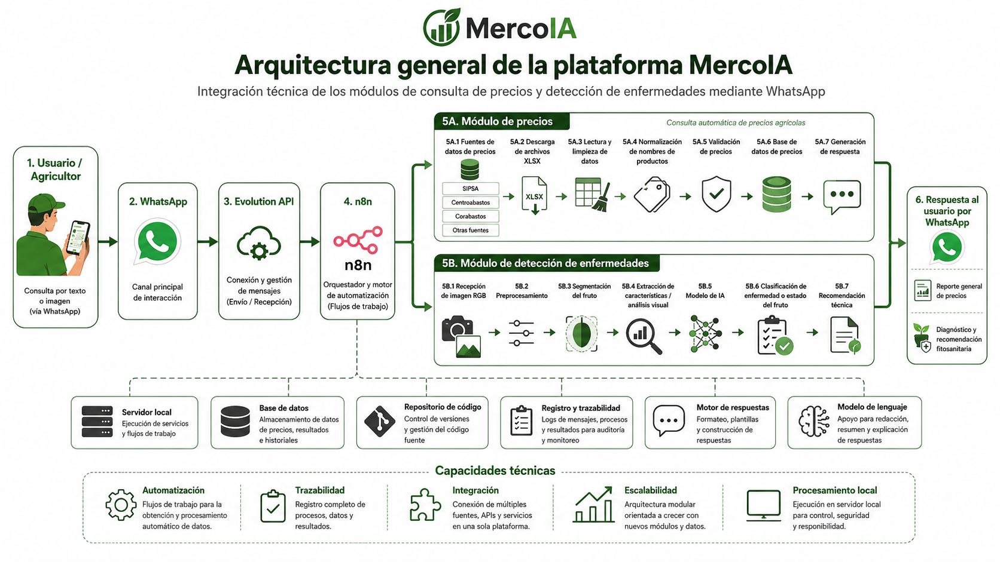
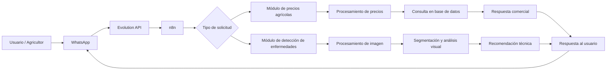
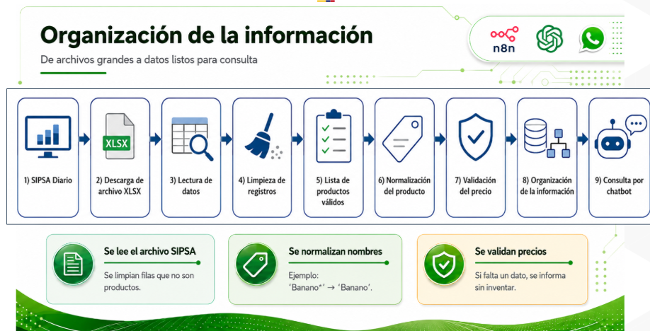
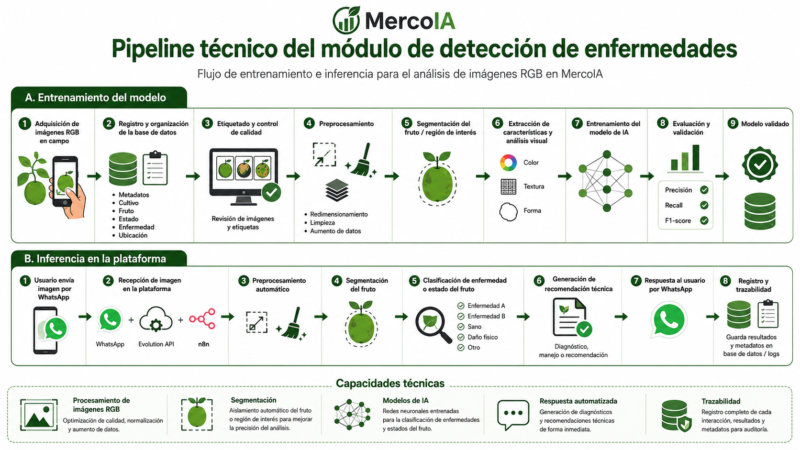
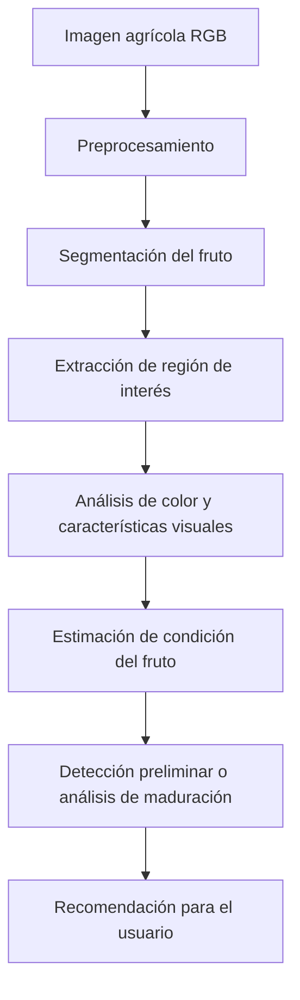

# MercoIA Platform

<p align="center">
  
</p>

## Plataforma digital inteligente para la soberanía alimentaria y el derecho a la alimentación

Este repositorio contiene la versión preliminar de desarrollo de **MercoIA**, una plataforma digital inteligente construida en el marco del proyecto:

**“Plataforma digital inteligente para la soberanía alimentaria y el derecho a la alimentación, basada en la consulta comparativa de precios en mercados mayoristas y la detección temprana de enfermedades en cultivos mediante IA, como herramienta para una producción sostenible y competitiva en asociaciones campesinas de Santander.”**

El proyecto busca apoyar a asociaciones campesinas y productores agrícolas mediante una herramienta digital que facilite el acceso a información relevante para la toma de decisiones en dos dimensiones principales:

1. **Comercialización agrícola**, mediante la consulta comparativa de precios de productos agrícolas en mercados mayoristas.
2. **Gestión fitosanitaria y productiva**, mediante el análisis de imágenes agrícolas usando modelos de inteligencia artificial para apoyar la detección de enfermedades, el análisis visual de frutos y la generación de recomendaciones.

La plataforma se desarrolla para contextos rurales, considerando la necesidad de construir soluciones accesibles, operables mediante canales digitales cotidianos y con capacidad de integrar módulos de automatización, procesamiento de datos e inteligencia artificial.

---

## Enfoque del proyecto

El enfoque de MercoIA consiste en integrar herramientas digitales y modelos de inteligencia artificial dentro de una arquitectura modular que permita a los usuarios interactuar con la plataforma de forma sencilla. En lugar de exigir que el agricultor utilice aplicaciones complejas o sistemas especializados, el diseño de la plataforma parte de canales de uso frecuente, como **WhatsApp**, y los conecta con flujos automáticos de procesamiento.

La herramienta se orienta a:

- Centralizar y procesar información de precios agrícolas.
- Facilitar consultas sobre precios de productos en mercados mayoristas.
- Organizar bases de datos de productos agrícolas.
- Procesar imágenes de frutos o cultivos.
- Apoyar tareas de detección, segmentación y análisis visual.
- Generar respuestas o recomendaciones útiles para el productor.
- Integrar módulos de inteligencia artificial con interfaces prácticas para usuarios no especializados.

---

## ¿Qué hace MercoIA?

MercoIA funciona como una plataforma digital compuesta por dos módulos principales:

### 1. Módulo de consulta de precios agrícolas

Este módulo permite consultar información de precios mayoristas de productos agrícolas. El sistema procesa información proveniente de fuentes de precios, organiza los datos, normaliza nombres de productos y permite generar respuestas automáticas al usuario.

### 2. Módulo de detección de enfermedades y análisis de frutos

Este módulo procesa imágenes agrícolas para apoyar tareas de segmentación, detección, análisis visual y estimación de condiciones relacionadas con enfermedades o maduración de frutos. El módulo se encuentra en etapa preliminar de desarrollo y validación.

Ambos módulos se integran dentro de una misma plataforma, permitiendo que la herramienta pueda crecer progresivamente hacia un sistema completo de apoyo a la toma de decisiones agrícolas.

---

## Arquitectura general de la plataforma

La arquitectura general de MercoIA conecta al usuario con servicios de automatización, procesamiento e inteligencia artificial. El flujo general contempla la interacción mediante WhatsApp, la conexión mediante Evolution API, la orquestación de procesos mediante n8n y la activación de los módulos de precios o de análisis de imágenes según el tipo de solicitud.

<p align="center">
  
</p>

De forma conceptual, el flujo general de la plataforma puede resumirse así:



---

## Estructura del repositorio

```text
MercoIA_Platform/
│
├── README.md
│
├── assets/
│   ├── logo_mercoia.png
│   ├── arquitectura_general_mercoia.png
│   ├── modulo_precios_n8n.png
│   ├── organizacion_informacion.png
│   └── pipelineenfermedades.png
│
├── Modulo_precios/
│   ├── docs/
│   ├── src/
│   └── workflows/
│
└── Modulo_Deteccion_enfermedades/
    ├── STSIVA/
    ├── codes_for_the_dataset/
    ├── images/
    └── network/
```

---

# Módulo de consulta de precios agrícolas

## Descripción del módulo

El **Módulo de precios** tiene como objetivo permitir la consulta automatizada de precios de productos agrícolas en mercados mayoristas. Este módulo busca reducir la dificultad que enfrentan los productores para acceder a información comercial actualizada, organizada y comparable.

El sistema procesa información de precios, identifica productos, limpia registros, normaliza nombres y prepara respuestas que pueden ser entregadas al usuario mediante un flujo automatizado.

Este módulo se apoya en:

- **n8n**, para automatización de flujos.
- **Evolution API**, para conexión con WhatsApp.
- Archivos de precios en formato **XLSX**.
- Rutinas de limpieza y normalización de información.
- Organización de datos para consulta.
- Respuestas automáticas mediante flujo conversacional.

---

## Flujo de actualización automática de precios

El flujo de actualización automática permite descargar, procesar y organizar información de precios. El diseño busca que el sistema valide productos, identifique archivos disponibles, descargue la información, procese registros y genere una estructura consultable.

<p align="center">
  
</p>

El flujo general del módulo de precios contempla las siguientes etapas:

1. **Generación de enlaces:** se crean rutas o enlaces candidatos para ubicar archivos de precios disponibles.
2. **Búsqueda de base reciente:** el sistema prueba diferentes enlaces hasta encontrar una fuente disponible.
3. **Descarga de archivo:** se descarga el archivo de precios en formato XLSX.
4. **Lectura de datos:** se extraen las columnas y registros necesarios.
5. **Limpieza de registros:** se eliminan filas que no corresponden a productos o precios válidos.
6. **Normalización de nombres:** se unifican nombres de productos para facilitar la consulta.
7. **Validación de precios:** se revisan datos faltantes o inconsistentes.
8. **Organización de información:** se estructura la información para consulta.
9. **Consulta por chatbot:** el usuario puede solicitar información de precios mediante WhatsApp.

---

## Organización de la información

La organización de la información es una etapa central del módulo de precios. El objetivo es transformar archivos de datos extensos en registros limpios, normalizados y útiles para consulta.

<p align="center">
  
</p>

El procesamiento incluye:

- Lectura de archivos fuente.
- Identificación de productos agrícolas.
- Limpieza de filas no válidas.
- Normalización de nombres.
- Validación de precios.
- Organización de registros por producto, mercado, presentación y fecha.
- Preparación de datos para consulta automática.

---

## Carpeta del módulo de precios

```text
Modulo_precios/
│
├── docs/
│
├── src/
│
└── workflows/
```

### `docs/`

Carpeta destinada a documentación técnica del módulo. Puede incluir:

```text
descripcion_modulo_precios.md
estructura_base_datos.md
pruebas_preliminares.md
```

### `src/`

Carpeta destinada a scripts de procesamiento, funciones auxiliares, limpieza de datos, extracción de características o rutinas utilizadas por el módulo.

### `workflows/`

Carpeta destinada a flujos exportados desde n8n. Los archivos de esta carpeta deben subirse **sin credenciales activas**.

Ejemplo recomendado:

```text
flujo_n8n_modulo_precios_sin_credenciales.json
```

---

# Módulo de detección de enfermedades y análisis de frutos

## Descripción del módulo

El **Módulo de detección de enfermedades y análisis de frutos** tiene como objetivo apoyar el diagnóstico visual y la evaluación de productos agrícolas mediante procesamiento de imágenes e inteligencia artificial.

Este módulo se encuentra orientado al análisis de imágenes RGB de frutos y cultivos, con énfasis en tareas como:

- Segmentación de frutos.
- Organización de bases de datos de imágenes.
- Etiquetado automático o semiautomático.
- Entrenamiento preliminar de redes neuronales.
- Identificación de características visuales.
- Análisis de color.
- Estimación de maduración.
- Generación de recomendaciones asociadas a cosecha o condición del producto.

Este componente busca contribuir a la detección temprana de enfermedades y al análisis del estado visual de los productos agrícolas, apoyando la toma de decisiones de los productores.

---

## Pipeline del módulo de detección

<p align="center">
  
</p>

El pipeline general del módulo se puede describir así:



---

## Carpeta del módulo de detección

```text
Modulo_Deteccion_enfermedades/
│
├── STSIVA/
│
├── codes_for_the_dataset/
│
├── images/
│
└── network/
```

### `STSIVA/`

Carpeta destinada a códigos, experimentos o archivos relacionados con la ponencia científica asociada al análisis visual de frutos, estimación de maduración y recomendación de cosecha.

### `codes_for_the_dataset/`

Carpeta destinada a scripts de construcción, limpieza, organización, segmentación y etiquetado de bases de datos de imágenes.

Puede incluir códigos para:

- Segmentación automática.
- Generación de etiquetas.
- Filtrado de imágenes.
- Aumento de datos.
- Conversión de formatos.
- Organización de carpetas.
- Preprocesamiento de imágenes.

### `images/`

Carpeta destinada a resultados visuales, ejemplos de imágenes, salidas de segmentación, figuras del pipeline, resultados preliminares y visualizaciones.

### `network/`

Carpeta destinada a códigos de entrenamiento, arquitecturas de red, modelos preliminares, pesos entrenados, scripts de inferencia y pruebas iniciales.

---

## Integración entre módulos

MercoIA se diseña como una plataforma integrada. El módulo de precios y el módulo de detección de enfermedades no son componentes aislados, sino partes de una misma herramienta de apoyo a la toma de decisiones.

El módulo de precios permite resolver preguntas comerciales como:

- ¿Cuál es el precio de referencia de un producto?
- ¿En qué mercado se reporta determinado precio?
- ¿Qué información reciente existe sobre un producto agrícola?
- ¿Cómo se organiza la información de precios para consulta?

El módulo de detección permite abordar preguntas técnicas como:

- ¿Qué condición visual presenta el fruto?
- ¿Se puede segmentar el producto en la imagen?
- ¿Cuál es el estado preliminar de maduración?
- ¿Qué recomendación puede generarse a partir del análisis visual?

La integración de ambos módulos permite avanzar hacia una plataforma que apoye simultáneamente decisiones de comercialización y decisiones asociadas al manejo productivo.

---

## Estado actual del desarrollo

El repositorio corresponde a una versión preliminar de desarrollo. Actualmente se cuenta con:

- Estructura inicial del repositorio de la plataforma.
- Organización independiente de los módulos de precios y detección.
- Flujo preliminar de automatización del módulo de precios.
- Rutinas iniciales para procesamiento y organización de información.
- Scripts preliminares para segmentación y análisis de imágenes.
- Resultados iniciales de detección, segmentación o maduración.
- Evidencias gráficas del flujo de trabajo.
- Base para la integración futura con WhatsApp y servicios automatizados.

La plataforma se encuentra en proceso de adecuación técnica, integración y validación funcional.

---

## Consideraciones de seguridad

Este repositorio no debe incluir información sensible ni credenciales activas. Antes de subir archivos, se debe verificar que no se incluyan:

- Tokens de Evolution API.
- Credenciales de n8n.
- Contraseñas de correo electrónico.
- Archivos `.env` con claves privadas.
- Números telefónicos de usuarios.
- Datos personales de productores.
- Información administrativa o financiera sensible.
- Bases de datos con información personal sin anonimización.

Los flujos exportados desde n8n deben subirse sin credenciales, sin claves privadas y sin datos sensibles de usuarios.

---

## Relación con productos del proyecto

Este repositorio funciona como soporte técnico del producto:

**Producto tecnológico certificado o validado: Software – Plataforma digital desplegada y optimizada.**

También se relaciona con los productos:

- **Herramienta software automatizada para la consulta de precios.**
- **Modelo de IA para detección temprana de enfermedades en cultivos a partir de imágenes.**
- **Bases de datos organizadas y procesadas.**
- **Informes técnicos asociados al desarrollo de la plataforma digital.**

---

## Entidades participantes

**Entidad ejecutora:** Federación Agroalimentaria y Agroambiental Campesina – MERCORED  
**Entidad aliada:** Universidad Industrial de Santander – UIS  
**Grupo aliado:** HDSP  
**Convenio:** 268-2025  
**Convocatoria:** SENAINNOVA 2024  

---

## Contacto

Para información relacionada con el desarrollo técnico de la plataforma:

**HDSP – Universidad Industrial de Santander**  
Correo: **hdsp@uis.edu.co**

Para información relacionada con la entidad ejecutora y articulación con asociaciones campesinas:

**Federación Agroalimentaria y Agroambiental Campesina – MERCORED**  
Correo: **federacionmercored@gmail.com**

---

## Nota de avance

Este repositorio corresponde a una versión preliminar de MercoIA. Los módulos, flujos, scripts, modelos y recursos visuales pueden ser modificados conforme avance el proceso de integración, validación, despliegue y retroalimentación con usuarios finales.
