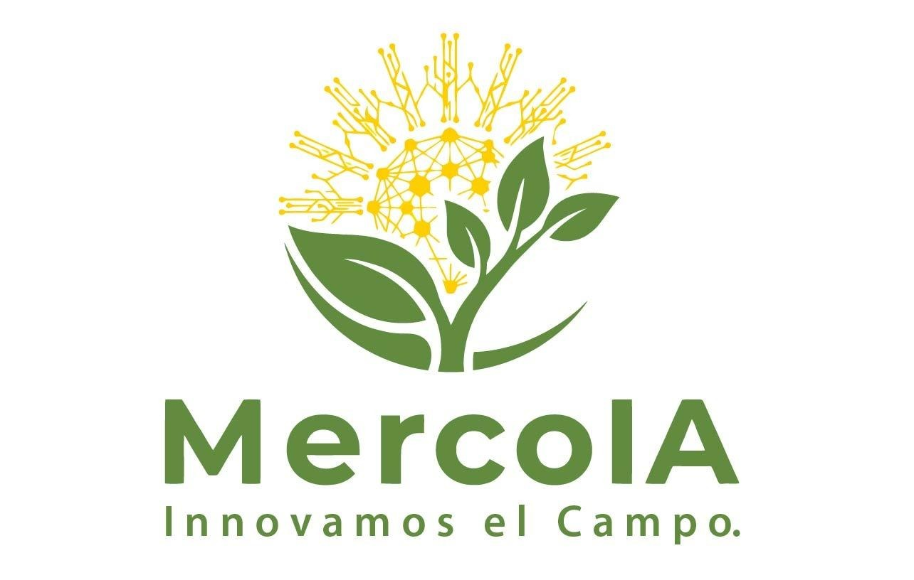

# MercoIA_Platform

<p align="center">
  
</p>

## Descripción general

**MercoIA** es una plataforma digital inteligente orientada al apoyo de asociaciones campesinas y productores agrícolas mediante la integración de herramientas de consulta de precios, procesamiento de datos e inteligencia artificial.

La plataforma se desarrolla en el marco del proyecto:

**“Plataforma digital inteligente para la soberanía alimentaria y el derecho a la alimentación, basada en la consulta comparativa de precios en mercados mayoristas y la detección temprana de enfermedades en cultivos mediante IA, como herramienta para una producción sostenible y competitiva en asociaciones campesinas de Santander.”**

El sistema integra dos módulos principales:

1. **Módulo de consulta de precios agrícolas**, orientado a la consulta comparativa de precios de productos agrícolas en mercados mayoristas.
2. **Módulo de detección de enfermedades y análisis de frutos**, orientado al procesamiento de imágenes agrícolas mediante modelos de inteligencia artificial.

El objetivo de la plataforma es facilitar el acceso a información útil para la toma de decisiones en comercialización agrícola y gestión fitosanitaria, usando canales digitales accesibles para los productores.

---

## Estructura del repositorio

```text
MercoIA_Platform/
│
├── README.md
│
├── assets/
│   ├── logo_mercoia.png
│   ├── modulo_precios_n8n.png
│   ├── organizacion_informacion.png
│   └── arquitectura_general_mercoia.png
│
├── Modulo_precios/
│   ├── docs/
│   ├── src/
│   └── workflows/
│
└── Modulo_Deteccion_enfermedades/
    ├── STSIVA/
    ├── codes_for_the_dataset/
    ├── images/
    └── network/
